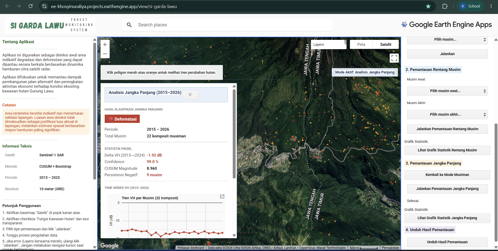
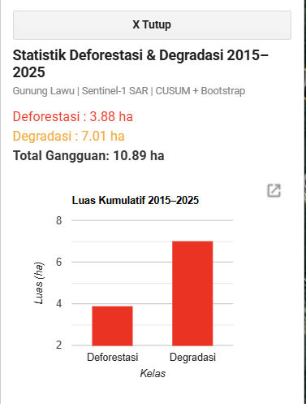
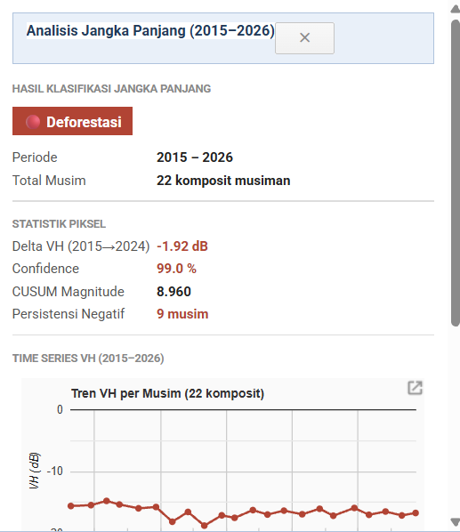
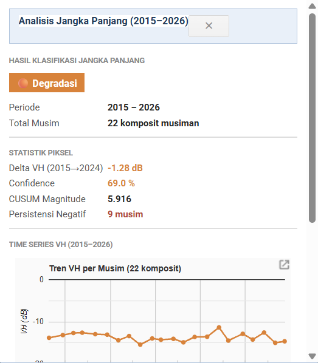

# Si Garda Lawu
Aplikasi Google Earth Engine untuk pemantauan indikatif deforestasi dan degradasi hutan di Kawasan Hutan Gunung Lawu tahun 2015–2025 menggunakan citra Sentinel-1 SAR, analisis deret waktu CUSUM, dan bootstrap analysis.

## Deskripsi
- "Si Garda Lawu" dikembangkan untuk mendeteksi area yang terindikasi mengalami perubahan tutupan hutan secara musiman, rentang musim, dan jangka panjang. Aplikasi ini memanfaatkan citra radar Sentinel-1 agar pemantauan tetap dapat dilakukan pada wilayah tropis yang sering tertutup awan.
- Hasil yang ditampilkan bersifat **indikatif**, sehingga tetap memerlukan validasi visual maupun lapangan sebelum digunakan sebagai dasar pengambilan keputusan final.

## Tujuan
Aplikasi ini dibangun untuk:
1. Memetakan sebaran spasial area yang terindikasi mengalami deforestasi dan degradasi di kawasan hutan Gunung Lawu.
2. Mengevaluasi kemampuan pendekatan deret waktu berbasis algoritma CUSUM dalam mendeteksi perubahan tutupan hutan tahun 2015–2025.
3. Menyediakan informasi spasial awal melalui GEE-App untuk mendukung peninjauan dan evaluasi kawasan hutan.

## Wilayah Studi
Kawasan Hutan Gunung Lawu yang meliputi wilayah administrasi di sebagian Kabupaten Karanganyar, Provinsi Jawa Tengah dan Kabupaten Magetan, Provinsi Jawa Timur.

## Sumber Data
- Sentinel-1 GRD SAR
- DEM SRTM
- Batas kawasan hutan Gunung Lawu (Kementerian Kehutanan)
- Batas administrasi Kabupaten Karanganyar dan Magetan (Badan Informasi Geospasial)

## Metode
Metode utama yang digunakan dalam aplikasi ini meliputi:
- Preprocessing citra Sentinel-1 (`VV`, `VH`)
- Masking topografi menggunakan slope dan aspect
- Penyusunan komposit musiman
- Perhitungan baseline dan residual deret waktu
- Analisis perubahan dengan **CUSUM**
- Validasi konsistensi perubahan menggunakan **bootstrap analysis**
- Klasifikasi indikatif deforestasi dan degradasi
- Visualisasi hasil dalam GEE-App

## Fitur Aplikasi
Aplikasi menyediakan tiga jenis analisis:
- **Pemantauan Per Musim**
- **Pemantauan Rentang Musim**
- **Pemantauan Jangka Panjang**

Fitur utama:
- Menampilkan hasil indikatif deforestasi dan degradasi
- Menampilkan grafik statistik perubahan
- Menampilkan luas area deteksi berdasar respon hamburan citra satelit SAR Sentinel-1
- Mengunduh hasil analisis dalam bentuk data spasial
- Menampilkan proses ditetapkannya poligon sebagai area indikatif saat poligon diklik

## Keluaran
Keluaran utama aplikasi meliputi:
- Layer indikatif deforestasi
- Layer indikatif degradasi
- Statistik luas perubahan
- Analisis setiap poligon yang dihasilkan berupa proses dinamika hamburan hingga ditetapkan menjadi area indikatif
- File hasil unduhan untuk analisis lanjutan

## Interpretasi Hasil
- **Deforestasi**: area dengan indikasi penurunan tutupan hutan yang lebih kuat dan mengarah pada perubahan permanen
- **Degradasi**: area dengan indikasi penurunan kualitas/ kerapatan vegetasi, bersifat sementara, dan dapat dimungkinkan kembali menjadi kawasan hutan
- **Tidak berubah**: area yang tidak menunjukkan perubahan signifikan berdasarkan ambang batas

## Keterbatasan
- Hasil bersifat indikatif, bukan klasifikasi final penutupan lahan
- Respon hamburan radar dipengaruhi oleh dinamika topografi, tutupan awan, dan kelembapan/ kondisi permukaan
- Deteksi perubahan berupa patch kecil dapat lebih sulit dikenali
- Kecepatan pemrosesan dipengaruhi oleh beban komputasi Google Earth Engine dan koneksi internet
- Pemrosesan memerlukan waktu lama karena data spasial yang besar, tapi dimungkinkan efektif untuk pantauan beberapa tahun dalam sekali tekan

## Uji Akurasi
Evaluasi akurasi dilakukan menggunakan confusion matrix berbasis stratified random sampling. Uji akurasi menunjukkan bahwa model memiliki kemampuan yang cukup baik untuk mendeteksi lokasi perubahan, meskipun kelas degradasi masih lebih sulit diidentifikasi secara konsisten dibandingkan deforestasi dan area tidak berubah.

## Cara Penggunaan Aplikasi
1. Buka tautan Google Earth Engine Apps
2. Aktifkan basemap `Satelit`
3. Tampilkan layer kawasan hutan bila diperlukan
4. Pilih jenis pemantauan:
   - Per musim
   - Rentang musim
   - Jangka panjang
5. Klik tombol jalankan analisis
6. Tunggu hingga hasil pemantauan ditampilkan
7. Munculkan grafik statistik atau unduh hasil analisis jika diperlukan

## Pengembangan Selanjutnya
- Integrasi dengan data citra lain atau citra resolusi lebih tinggi
- Penambahan analisis berbasis buffer terhadap jaringan jalan/infrastruktur
- Penyempurnaan threshold klasifikasi
- Optimasi fitur ekspor
- Peningkatan validasi otomatis berbasis data referensi

## Tampilan GEE Apps
- Halaman Utama

- Halaman Analisis

- Statistik Luas Perubahan

- Proses Penetapan Area sebagai Indikatif Deforestasi/Degradasi

<!--  -->

## Pengembang
- Khosyi Nur Aliya di bawah pengawasan oleh Dr. Like Indrawati, S.Si., M.Sc.
- Project sebagai bagian dari penelitian Sagit statusrjana Terapan Sistem Informasi Geografis, Universitas Gadjah Mada
- Temukan saya di [Linkedin](https://www.linkedin.com/in/khosyi-nur-aliya-15b6aa2a7/) atau [email](khosyinuraliya@mail.ugm.ac.id)